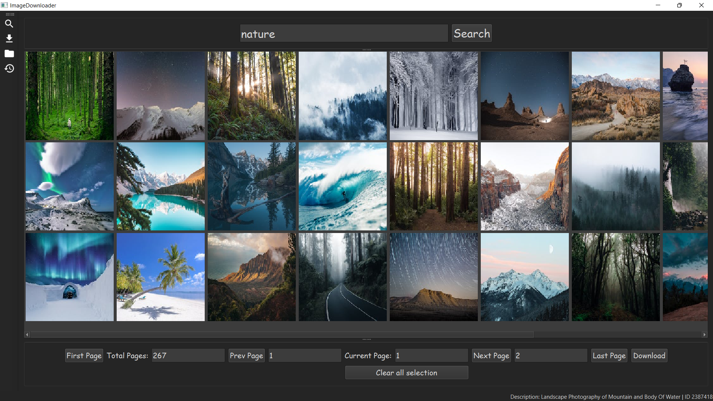
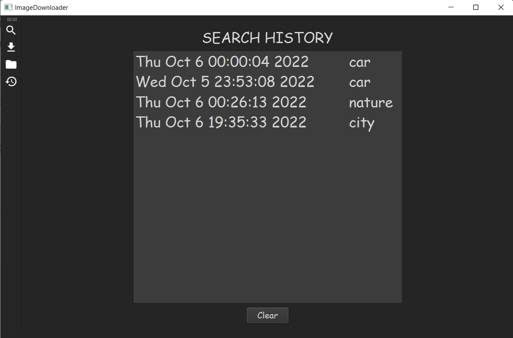
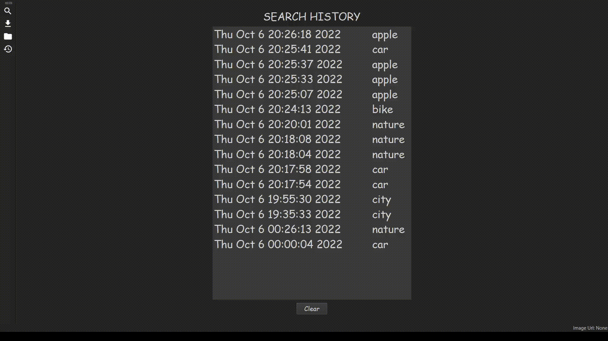
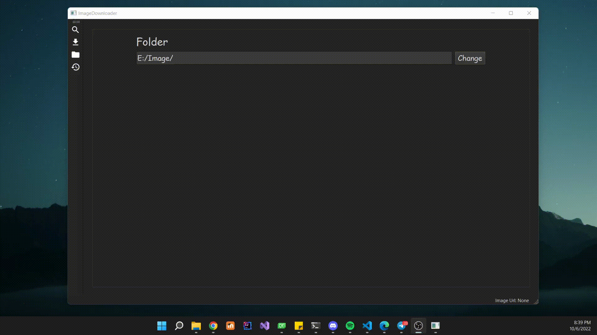
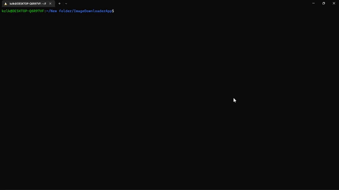

# Image Downloader Application

## About
This is image downloader application to view/download image by keyword from [Pexels](https://www.pexels.com/ "Pexels Home") using [Pexels API](https://www.pexels.com/api/ "API documentation"). 

 [ To view bug, problems, need to-do click this!](#TO-DO)
***
##  Implemented features
*  Search for pictures over [Pexels](https://www.pexels.com/ "Pexels Home") by keyword
* Show images in thumbnails and display their names (on status bar) like gallery
* Dark mode 

---
* Convenient transition between application windows using the left menu bar

---
* Caching picture in order to speed up application and decrease traffic
* Downloading picture

    * Click on the picture thumbnail to select the image for downloading (the selected picture will mark by blue color), **supported multiply selection**
    * Click on the selected picture to deselect it, or click on the button "Clear all selection"
    * Click on button "Download" to download selected pictures 
    * If few pictures selected they will be **downloaded in parallel** 
    * Downloading original picture size
---

* Show progress indicator for each current downloading picture

---
* Ability to see search history
    * Click on search history item to select for deleting (support multiply selection) by button "Clear"

|Add history|Delete history|
|----|-----|  
| ||

---
* Ability to set folder for saving the pictures
    * If there no folder set - app using default downloading folder for Windows / Linux
    * If the folder is deleted when you are using the app and clicking to download, then pop - the up message that the folder does not exist

---
* Non-blocking UI (not freeze while using the app)

---
* Double click on image item (thumbnail) to open photo preview

---
* Compile for Linux and Windows 

 

***
## TO-DO && BUGS

* Code
    * delete unused code
    * delete code for debugging
    * add comments 
    * update function to view progress bar
        * add view photo names
        * add view downloaded size (1.2mb / 9.5 mb) instead procent

* Bug 
    * crash when search some unknown words like "jkkjd" and other unknown sequences
    * crash when very fast click to button "Search"

